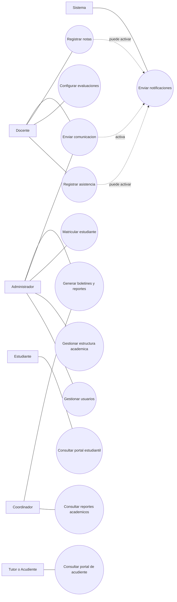

(Aqui iba una imagen)

**EduTrack - Documentación y Pruebas de Software**

**Grupo 01:**

Duan Andrés Pineda Corrales

José Anibal Pinto Fernández

**Grupo 03:**

Beykel Jhosep Pinto Fernández

Ingeniería de Software II

Maribel Romero Mestre

Ingeniería de Sistemas

Universidad Popular del Cesar

Valledupar - Cesar

2026

**PRIMERA PARTE**

- **DESCRIPCION DEL SISTEMA**
  - IDENTIFICACION DEL PROBLEMA
  - DESCRIPCIÓN DETALLADA DEL SISTEMA O APLICACION
  - MODELO DE REQUERIMIENTOS
    - Descripción Requisitos funcionales
    - Descripción Requisitos no funcionales
  - MODELO DE CASOS DE USO
    - Diagramas de caso de uso
    - Descripción de caso de uso
  - MODELO DE DISEÑO DEL SISTEMA
    - Diagrama de clases detallado
    - Diagramas de secuencias
    - Diagrama entidad relación
    - Diagrama de componentes
  - PRODUCTO DEL SOFTWARE

**SEGUNDA PARTE**

- **PRUEBAS DEL SOFTWARE**
  - INTRODUCCIÓN
  - **PLANIFICACIÓN DE LAS PRUEBAS**
    - Objetivos de las pruebas
    - Alcance de las pruebas
    - Estrategias de pruebas
    - Ambiente de pruebas
  - **PRUEBAS UNITARIAS**

Análisis de las pruebas

Diseño de casos de pruebas

Ejecución y evaluación de las pruebas

- 1. **PRUEBAS DE INTEGRACIÓN**
     - Estrategia de Pruebas incrementales
- Diseño casos de pruebas
- Ejecución y evaluación de las pruebas de integración
  - 1. Estrategia de Pruebas basadas en hilos
- Diseño casos de pruebas
- Ejecución y evaluación de las pruebas de integración
  - **PRUEBAS DE SISTEMAS**
    - Pruebas de seguridad

Diseño, ejecución y evaluación de las pruebas

- - 1. Pruebas de Rendimiento

Diseño, ejecución y evaluación de las pruebas

- - 1. Pruebas de Usabilidad

Diseño, ejecución y evaluación de las pruebas

- - 1. Pruebas de Portabilidad

Diseño, ejecución y evaluación de las pruebas

- 1. **PRUEBAS DE ACEPTACIÓN**
     - Diseño de caso de pruebas
     - Ejecución y evaluación de la prueba
  - **CONCLUSIONES**

**PRIMERA PARTE**

# 1\. DESCRIPCIÓN DEL SISTEMA

## 1.1 Identificación del Problema

Los colegios privados de tamaño medio que manejan entre 400 y 800 matrículas operan, en su mayoría, con herramientas desarticuladas: hojas de cálculo aisladas, mensajería informal (WhatsApp, correo electrónico) y reportes elaborados manualmente. Esta fragmentación genera inconsistencias frecuentes en los datos académicos, duplicidad de registros, retrasos en la detección de bajo desempeño estudiantil y ausencia de trazabilidad sobre alertas o seguimientos.

La falta de un sistema integrado dificulta la toma de decisiones oportunas por parte de directivos y coordinadores, reduce la confianza entre los actores institucionales y obliga a los docentes a invertir tiempo valioso en tareas administrativas repetitivas en lugar de concentrarse en la labor pedagógica.

EduTrack Web surge como respuesta directa a esta problemática, proponiendo una plataforma centralizada que unifica la gestión de estudiantes, matrículas, cursos, asistencia, calificaciones, comunicaciones y reportes en un único entorno web accesible para todos los actores institucionales.

## 1.2 Descripción del Sistema o Aplicación

EduTrack Web es una aplicación web de gestión académica desarrollada con arquitectura Cliente-Servidor desacoplada. El sistema centraliza y automatiza los procesos académicos más críticos de un colegio privado de tamaño medio, reemplazando los métodos manuales y dispersos por flujos validados, estandarizados y trazables.

### 1.2.1 Funcionalidades Principales

- Gestión de usuarios y roles: creación y administración de cuentas con control de acceso por rol.
- Gestión de matrículas: registro de estudiantes, asignación a grados y grupos con sincronización automática.
- Registro de asistencia: marcación diaria con detección de duplicados y actualización automática (UPSERT).
- Gestión de calificaciones: instrumentos de evaluación con pesos ponderados (suma 100%), cálculo automático de promedios.
- Comunicaciones institucionales: mensajería formal con registro de lectura auditado.
- Tableros de estadísticas: indicadores por grado, curso y período.
- Portales diferenciados: interfaz personalizada para cada perfil de usuario.
- Exportación de reportes: generación de archivos Excel y PDF (boletines).

### 1.2.2 Tecnologías Utilizadas

| **Capa**      | **Tecnología**               | **Descripción**                                           |
| ------------- | ---------------------------- | --------------------------------------------------------- |
| Backend       | ASP.NET Core 8 Web API (C#)  | API RESTful con Entity Framework Core y autenticación JWT |
| Frontend      | React + Vite                 | Interfaz de usuario reactiva y responsiva                 |
| Base de datos | SQL Server LocalDB           | Base de datos relacional gestionada con EF Core ORM       |
| Seguridad     | JWT (JSON Web Tokens)        | Autenticación basada en tokens con roles de usuario       |
| Ambiente      | Localhost (desarrollo local) | localhost:5173 (frontend) / localhost:5000 o 7000 (API)   |

### 1.2.3 Metodología de Desarrollo

El desarrollo siguió un enfoque iterativo e incremental, construyendo módulo por módulo con validaciones integradas en cada capa. La arquitectura implementa el patrón MVC en el backend, con una capa de servicios que encapsula la lógica de negocio más compleja.

## 1.3 Requisitos del Sistema

### 1.3.1 Requisitos Funcionales

| **Codigo** | **Nombre**                            | **Descripcion**                                                                 | **Actor Principal**      |
| ---------- | ------------------------------------- | ------------------------------------------------------------------------------- | ------------------------ |
| RF01       | Gestionar usuarios                    | Permitir crear, editar, activar, desactivar y asignar roles a los usuarios.    | Administrador            |
| RF02       | Gestionar grados, grupos y cursos     | Permitir crear y organizar grados, grupos, asignaturas y carga docente.         | Administrador / Coord.   |
| RF03       | Matricular estudiantes                | Permitir registrar estudiantes y ubicarlos en su grado y grupo correspondiente. | Administrador            |
| RF04       | Registrar asistencia diaria           | Permitir al docente marcar asistencia por fecha y curso, y corregir si se pasa. | Docente                  |
| RF05       | Configurar evaluaciones               | Permitir definir actividades y porcentajes de evaluacion por periodo.           | Docente                  |
| RF06       | Registrar y publicar notas            | Permitir ingresar notas y calcular el resultado final automaticamente.          | Docente                  |
| RF07       | Consultar rendimiento academico       | Permitir ver notas, asistencia y observaciones por estudiante y por curso.      | Directivo / Coord.       |
| RF08       | Consultar informacion por rol         | Mostrar a cada usuario solo lo que le corresponde segun su perfil.              | Todos                    |
| RF09       | Enviar comunicaciones institucionales | Permitir enviar mensajes, avisos y citaciones con registro de lectura.          | Administrador / Docente  |
| RF10       | Generar reportes y boletines          | Permitir descargar reportes academicos y boletines en formatos imprimibles.     | Administrador / Coord.   |
| RF11       | Ver portal del estudiante             | Permitir que el estudiante consulte su avance, mensajes y observaciones.         | Estudiante               |
| RF12       | Ver portal del acudiente              | Permitir que el acudiente consulte el avance del estudiante y reciba alertas.   | Tutor / Acudiente        |

### 1.3.2 Requisitos No Funcionales

| **Código** | **Categoría**  | **Descripción**                                                          |
| ---------- | -------------- | ------------------------------------------------------------------------ |
| RNF01      | Seguridad      | Encriptar contraseñas antes de almacenarlas.                             |
| RNF02      | Rendimiento    | Responder consultas en menos de 2 segundos bajo carga normal.            |
| RNF03      | Portabilidad   | Ejecutarse en Chrome, Edge y Firefox.                                    |
| RNF04      | Usabilidad     | Interfaz sencilla y amigable para todos los perfiles.                    |
| RNF05      | Confiabilidad  | Garantizar integridad de la información, evitando pérdida o duplicación. |
| RNF06      | Compatibilidad | Compatible con Windows, Linux y macOS en entorno web.                    |
| RNF07      | Concurrencia   | Permitir acceso simultáneo de al menos 200 usuarios.                     |

## 1.4 Modelo de Casos de Uso

### 1.4.1 Actores del Sistema

| **Actor**         | **Descripcion**                                    | **Responsabilidades Principales**                                             |
| ----------------- | -------------------------------------------------- | ----------------------------------------------------------------------------- |
| Administrador     | Persona encargada del control general del sistema. | Gestionar usuarios, estructura academica, matriculas y reportes generales.    |
| Coordinador       | Persona que supervisa el proceso academico.        | Hacer seguimiento al rendimiento, revisar reportes y apoyar a docentes.       |
| Docente           | Responsable del proceso en el aula.                | Registrar asistencia, evaluar estudiantes, publicar notas y enviar mensajes.  |
| Estudiante        | Usuario academico final.                           | Consultar notas, asistencia, observaciones y mensajes del colegio.            |
| Tutor / Acudiente | Familiar o responsable del estudiante.             | Consultar el avance del estudiante y revisar alertas o comunicaciones.        |
| Sistema           | Componente automatico de la plataforma.            | Enviar notificaciones y mantener actualizada la informacion en tiempo real.   |

### 1.4.2 Tabla de Casos de Uso

| **Codigo** | **Nombre**                     | **Actor Principal**      | **Descripcion**                                                                    |
| ---------- | ------------------------------ | ------------------------ | ---------------------------------------------------------------------------------- |
| CU01       | Gestionar usuarios             | Administrador            | Crear, editar y asignar roles a los usuarios del sistema.                         |
| CU02       | Gestionar estructura academica | Administrador            | Crear y actualizar grados, grupos, asignaturas y asignaciones docentes.           |
| CU03       | Matricular estudiante          | Administrador            | Registrar estudiante y asignarlo al grado y grupo correspondiente.                |
| CU04       | Registrar asistencia           | Docente                  | Marcar asistencia diaria por curso y dejar observaciones cuando sea necesario.    |
| CU05       | Configurar evaluaciones        | Docente                  | Definir actividades y porcentajes por periodo academico.                           |
| CU06       | Registrar notas                | Docente                  | Cargar notas por actividad y generar el resultado final automaticamente.           |
| CU07       | Enviar comunicacion            | Administrador / Docente  | Enviar mensajes o avisos y llevar control de quienes los leyeron.                 |
| CU08       | Consultar reportes academicos  | Coordinador              | Revisar indicadores por curso, grado, periodo y estudiante.                        |
| CU09       | Consultar portal estudiantil   | Estudiante               | Ver notas, asistencia, observaciones y mensajes personales.                        |
| CU10       | Consultar portal de acudiente  | Tutor / Acudiente        | Ver el avance del estudiante y revisar alertas o comunicaciones del colegio.       |
| CU11       | Generar boletines y reportes   | Administrador / Coord.   | Exportar boletines y reportes para seguimiento academico y entrega institucional.  |
| CU12       | Enviar notificaciones          | Sistema                  | Generar alertas automaticas cuando hay novedades importantes.                      |

### 1.4.3 Descripcion Detallada de Casos de Uso Relevantes

**CU01 - Gestionar usuarios**

Proposito: Mantener actualizados los usuarios para que cada persona tenga su acceso correcto.

Precondiciones: El administrador ha iniciado sesion en el modulo de administracion.

Flujo principal:

1. El administrador entra a la opcion de usuarios.
2. El sistema muestra la lista actual de usuarios.
3. El administrador crea uno nuevo o edita uno existente.
4. Asigna el rol correspondiente.
5. El sistema valida la informacion y guarda.
6. El sistema confirma el resultado.

Flujos alternos:

- Si un correo o usuario ya existe, el sistema lo informa y no permite guardar hasta corregir.
- Si faltan datos obligatorios, el sistema marca los campos pendientes.

Resultado esperado: Usuario creado o actualizado con el rol correcto.

**CU04 - Registrar asistencia**

Proposito: Llevar un control diario de presencia de los estudiantes.

Precondiciones: El docente tiene asignado el curso.

Flujo principal:

1. El docente elige curso y fecha.
2. El sistema muestra la lista de estudiantes.
3. El docente marca asistencia y agrega observaciones si hace falta.
4. El docente guarda.
5. El sistema registra la informacion o la actualiza si ese dia ya estaba cargado.
6. El sistema confirma el guardado.

Flujos alternos:

- Si no hay estudiantes matriculados en el curso, el sistema informa que no hay lista para esa fecha.
- Si ocurre un error de conexion, el sistema muestra aviso y permite reintentar.

Resultado esperado: Asistencia guardada correctamente para el curso y fecha.

**CU06 - Registrar notas**

Proposito: Guardar las notas de cada actividad y calcular el resultado final del periodo.

Precondiciones: El docente ya configuro actividades y porcentajes del periodo.

Flujo principal:

1. El docente selecciona curso, asignatura y periodo.
2. El sistema muestra actividades y estudiantes.
3. El docente ingresa o ajusta notas.
4. El sistema calcula el acumulado de forma automatica.
5. El docente publica las notas.
6. El sistema confirma la publicacion.

Flujos alternos:

- Si los porcentajes no estan completos, el sistema no deja publicar.
- Si una nota esta fuera del rango permitido, el sistema solicita correccion.

Resultado esperado: Notas registradas y visibles para consulta segun el rol.

**CU10 - Consultar portal de acudiente**

Proposito: Permitir al acudiente hacer seguimiento facil al avance del estudiante.

Precondiciones: El acudiente tiene acceso activo y esta vinculado al estudiante.

Flujo principal:

1. El acudiente inicia sesion.
2. El sistema muestra panel de resumen del estudiante.
3. El acudiente revisa notas, asistencia, observaciones y mensajes.
4. El sistema marca como leidos los mensajes consultados.

Flujos alternos:

- Si no hay informacion nueva, el sistema lo informa claramente.

Resultado esperado: Acudiente informado y con seguimiento actualizado.

### 1.4.4 Diagrama de Casos de Uso

## 1.5 Modelo de Diseño del Sistema

Esta sección mantiene la unidad entre requisitos funcionales (RF01-RF12), casos de uso (CU01-CU12) y modelo de clases.

Regla de consistencia: cada requisito debe verse en al menos un caso de uso y en una o más clases del dominio.

### 1.5.1 Diagrama de Clases - Entidades Principales (alineado con requisitos y casos de uso)

El sistema EduTrack Web está estructurado por estas entidades principales:

- Usuario: credenciales, rol y datos personales.
- Docente: perfil académico asociado a Usuario.
- Estudiante: perfil estudiantil asociado a Usuario.
- Tutor: perfil acudiente asociado a Usuario.
- TutorEstudiante: tabla pivote entre Tutor y Estudiante.
- Grado: nivel académico.
- Curso: curso activo por período.
- Asignatura: materia académica.
- CursoAsignatura: vínculo entre Curso y Asignatura.
- Inscripcion: matrícula del estudiante.
- Asistencia: registro de presencia por fecha y asignatura.
- NotaConfig: instrumentos y ponderaciones de evaluación.
- Nota: calificación por estudiante.
- Comunicacion: mensaje institucional.
- ComunicacionDestino: destinatario y estado de lectura.

Relaciones clave:

- Usuario 1..1 Docente / Estudiante / Tutor.
- Tutor N..N Estudiante mediante TutorEstudiante.
- Grado 1..N Curso.
- Curso N..N Asignatura mediante CursoAsignatura.
- Estudiante 1..N Inscripcion y Curso 1..N Inscripcion.
- Estudiante 1..N Asistencia.
- Estudiante 1..N Nota y NotaConfig 1..N Nota.
- Comunicacion 1..N ComunicacionDestino.

Matriz de unidad (Requisito -> Caso de uso -> Clases):

| Requisito | Caso(s) de uso | Clases principales |
| --- | --- | --- |
| RF01 Gestionar usuarios y roles | CU01 | Usuario |
| RF02 Gestionar docentes y tutores | CU02 | Docente, Tutor, Usuario, TutorEstudiante |
| RF03 Gestionar grados, cursos y asignaturas | CU03 | Grado, Curso, Asignatura, CursoAsignatura |
| RF04 Registrar asistencia | CU04 | Asistencia, Estudiante, CursoAsignatura |
| RF05 Configurar evaluaciones y ponderaciones | CU05 | NotaConfig, CursoAsignatura |
| RF06 Registrar y actualizar notas | CU06 | Nota, NotaConfig, Estudiante |
| RF07 Publicar información académica | CU07 | Nota, Asistencia, Comunicacion |
| RF08 Enviar comunicaciones | CU08 | Comunicacion, ComunicacionDestino, Usuario |
| RF09 Consultar portal de estudiante | CU09 | Estudiante, Inscripcion, Nota, Asistencia |
| RF10 Consultar portal de acudiente | CU10 | Tutor, TutorEstudiante, Estudiante, Nota, Asistencia |
| RF11 Generar boletines y reportes | CU11 | Nota, Asistencia, Estudiante, Curso |
| RF12 Notificaciones automáticas | CU12 | Comunicacion, ComunicacionDestino |

Nota: si se crea un nuevo requisito, se debe agregar su caso de uso y su impacto en clases.

### 1.5.2 Diagrama de Secuencia (pendiente)

Objetivo: mostrar cómo colaboran actor, frontend, backend y base de datos en un flujo completo.

Caso recomendado para diagramar: CU06 Registrar y actualizar notas.

Participantes sugeridos:

- Docente.
- Frontend Web (React).
- NotasController (API).
- Servicio de Notas.
- AppDbContext / SQL Server.
- NotificationHub (opcional).

Flujo principal sugerido:

1. Docente registra notas en la interfaz.
2. Frontend valida y envía petición a API.
3. API valida permisos y reglas de negocio.
4. Servicio guarda o actualiza notas en base de datos.
5. API responde éxito o error.
6. Frontend muestra confirmación.
7. Opcional: notificación a estudiante o tutor.

Texto listo para IA (prompt):

"Genera un diagrama de secuencia UML para EduTrack Web del caso CU06 Registrar y actualizar notas. Incluye los participantes: Docente, Frontend React, NotasController ASP.NET Core, ServicioNotas, AppDbContext, SQL Server y NotificationHub opcional. Representa flujo exitoso y flujo alterno por error de validación de ponderación o permisos, usando bloques alt."

### 1.5.3 Diagrama Entidad-Relación (pendiente)

Objetivo: representar la estructura de datos y sus cardinalidades.

Entidades mínimas:

- Usuario, Docente, Estudiante, Tutor, TutorEstudiante.
- Grado, Curso, Asignatura, CursoAsignatura.
- Inscripcion, Asistencia.
- NotaConfig, Nota.
- Comunicacion, ComunicacionDestino.

Relaciones mínimas:

- Usuario con Docente/Estudiante/Tutor (1:1).
- Tutor con Estudiante (N:N por TutorEstudiante).
- Grado con Curso (1:N).
- Curso con Asignatura (N:N por CursoAsignatura).
- Estudiante con Inscripcion (1:N).
- Estudiante con Asistencia (1:N).
- Estudiante con Nota (1:N).
- NotaConfig con Nota (1:N).
- Comunicacion con ComunicacionDestino (1:N).

Texto listo para IA (prompt):

"Genera un diagrama entidad-relación para EduTrack Web con las entidades Usuario, Docente, Estudiante, Tutor, TutorEstudiante, Grado, Curso, Asignatura, CursoAsignatura, Inscripcion, Asistencia, NotaConfig, Nota, Comunicacion y ComunicacionDestino. Incluye PK, FK y cardinalidades, destacando las tablas pivote TutorEstudiante y CursoAsignatura."

### 1.5.4 Diagrama de Componentes (pendiente)

Objetivo: mostrar la arquitectura técnica y dependencias entre módulos.

Componentes mínimos:

- Frontend (React + Vite).
- API REST (ASP.NET Core).
- Controladores.
- Servicios de negocio.
- Capa de datos (EF Core + AppDbContext).
- Base de datos SQL Server.
- Módulo JWT.
- NotificationHub (SignalR).

Conexiones mínimas:

- Frontend consume API por HTTP/JSON.
- API aplica JWT para autenticación/autorización.
- Controladores delegan en servicios.
- Servicios usan AppDbContext.
- AppDbContext persiste en SQL Server.
- API y servicios publican notificaciones en NotificationHub.

Texto listo para IA (prompt):

"Genera un diagrama de componentes UML para EduTrack Web con Frontend React, API ASP.NET Core, capa de Controladores, capa de Servicios, AppDbContext EF Core, SQL Server, módulo JWT y SignalR NotificationHub. Muestra dependencias y el flujo Frontend -> API -> Servicios -> Datos -> Base de datos."

### 1.5.5 Checklist de unidad entre análisis y diseño

1. Cada RF aparece en al menos un CU.
2. Cada CU está soportado por clases del dominio.
3. Cada entidad del diagrama de clases existe en el diagrama ER o tiene justificación.
4. Los flujos críticos tienen al menos un diagrama de secuencia.
5. El diagrama de componentes coincide con la arquitectura implementada.

### 2.2.2 Alcance

El alcance del plan de pruebas cubre los modulos principales del sistema y los tipos de prueba que se aplicaran a cada uno.

| Modulo / funcionalidad | Que se valida | Tipos de prueba |
| --- | --- | --- |
| Autenticacion y usuarios | Acceso, roles, permisos y sesion | Unitarias, integracion, seguridad |
| Gestion academica (grados, cursos, asignaturas, matriculas) | Creacion, consulta y relacion entre datos | Unitarias, integracion, sistemas |
| Asistencia | Registro, actualizacion y consulta | Unitarias, integracion, sistemas |
| Calificaciones y ponderaciones | Configuracion de evaluaciones y calculo de notas | Unitarias, integracion, sistemas |
| Comunicaciones | Envio, recepcion y lectura de mensajes | Unitarias, integracion, interfaz de usuario |
| Portales de estudiante y acudiente | Visualizacion de informacion y experiencia de uso | Sistemas, interfaz de usuario, aceptacion |
| Reportes y boletines | Generacion y exportacion de documentos | Integracion, sistemas, aceptacion |

En este alcance se incluyen pruebas unitarias, de integracion, de sistemas (entorno, seguridad e interfaz de usuario) y de aceptacion, segun corresponda a cada modulo.

### 2.2.3 Estrategias de Pruebas

| Tipo de prueba | Tecnica de prueba | Modelo / estrategia / tipo | Herramientas |
| --- | --- | --- | --- |
| Unitarias | Caja negra: particion de equivalencia y valores limite | Validacion de entradas en formularios y endpoints | Postman, navegador web |
| Unitarias | Caja blanca: camino basico y complejidad ciclomatica | Analisis de flujos logicos del codigo backend | Codigo fuente C# (VS Code) |
| Integracion | Integracion incremental ascendente | Estrategia Bottom-Up entre modulos | Postman, Swagger UI |
| Integracion | Pruebas basadas en hilos | Flujos completos extremo a extremo | Postman, Swagger UI |
| Sistemas | Seguridad (DAST, caja negra) | Top 10 OWASP: SQLi, XSS y headers | OWASP ZAP |
| Sistemas | Rendimiento | Load testing y stress testing | Apache JMeter |
| Sistemas | Usabilidad | Heuristicas de Nielsen y Core Web Vitals | Google Lighthouse |
| Sistemas | Portabilidad | Cross-browser y cross-device | Chrome DevTools, BrowserStack |
| Aceptacion | Aceptacion del usuario (UAT) | Historias de usuario y flujos de negocio | Navegador web |

### 2.2.4 Ambiente de Pruebas

**Configuración base de hardware:**

| **Componente**    | **Especificaciones Técnicas** |
| ----------------- | ----------------------------- |
| Procesador        | AMD Ryzen                     |
| Memoria RAM       | 16 GB                         |
| Almacenamiento    | SSD 500 GB                    |
| Sistema Operativo | Windows 10 (64 bits)          |

**Software para el ambiente de pruebas:**

| **Software**         | **Versión / Descripción**                      |
| -------------------- | ---------------------------------------------- |
| Visual Studio Code   | Editor principal de desarrollo y pruebas       |
| ASP.NET Core         | Versión 8.0 - Framework backend                |
| Node.js + Vite       | Empaquetador y servidor frontend React         |
| SQL Server LocalDB   | Motor de base de datos local (AcademiaNotasDB) |
| Postman / Swagger UI | Ejecución y validación de pruebas API          |
| Apache JMeter        | Pruebas de rendimiento y estrés                |
| OWASP ZAP            | Pruebas de seguridad (DAST)                    |
| Google Lighthouse    | Auditoría de usabilidad y accesibilidad        |
| Navegador web        | Google Chrome / Microsoft Edge                 |

# 3\. PRUEBAS UNITARIAS (seguir la plantilla)

## 3.1 Módulo de Gestión Académica (Cursos)
(Aqui iba una imagen)
### 3.1.1 Análisis de Pruebas - Clases de Equivalencia

**Identificación de Clases de Equivalencia:**

Campo: Nombre del Curso (longitud y obligatoriedad)

- \[CE-01\] VÁLIDA: Cadena alfanumérica entre 3 y 50 caracteres.
- \[CE-02\] INVÁLIDA: Cadena vacía o nula.
- \[CE-03\] INVÁLIDA: Cadena de 1 o 2 caracteres.
- \[CE-04\] INVÁLIDA: Cadena de más de 50 caracteres.

Campo: Capacidad Máxima (rango numérico)

- \[CE-05\] VÁLIDA: Número entero entre 15 y 45.
- \[CE-06\] INVÁLIDA: Valor ausente o no numérico.
- \[CE-07\] INVÁLIDA: Número entero menor a 15.
- \[CE-08\] INVÁLIDA: Número entero mayor a 45.

Campo: GradoId (identificador relacional)

- \[CE-09\] VÁLIDA: Número entero mayor a 0 y existente en el sistema.
- \[CE-10\] INVÁLIDA: Valor ausente o no numérico.
- \[CE-11\] INVÁLIDA: Número entero menor o igual a 0.
- \[CE-12\] INVÁLIDA: Número entero mayor a 0, pero inexistente en el sistema.

### Tabla de Casos de Prueba - Equivalencia

| **ID Caso** | **Descripción del Escenario** | **Nombre**            | **Capacidad** | **GradoId** | **Clases Cubiertas** | **Resultado Esperado**          |
| ----------- | ----------------------------- | --------------------- | ------------- | ----------- | -------------------- | ------------------------------- |
| CP-EQ-01    | Creación de curso exitosa     | "Matemáticas Básicas" | 30            | 2           | CE-01, CE-05, CE-09  | Éxito: Curso creado (201)       |
| CP-EQ-02    | Falla por campos nulos/vacíos | \[Nulo\]              | \[Nulo\]      | \[Nulo\]    | CE-02, CE-06, CE-10  | Falla: Error validación (400)   |
| CP-EQ-03    | Falla por Nombre muy corto    | "Ma"                  | 25            | 3           | CE-03, CE-05, CE-09  | Falla: Longitud mínima 3        |
| CP-EQ-04    | Falla por Nombre muy largo    | 51 caracteres         | 20            | 1           | CE-04, CE-05, CE-09  | Falla: Longitud máxima 50       |
| CP-EQ-05    | Falla por Capacidad mínima    | "Física I"            | 10            | 4           | CE-01, CE-07, CE-09  | Falla: Capacidad mínima 15      |
| CP-EQ-06    | Falla por Capacidad máxima    | "Química General"     | 60            | 2           | CE-01, CE-08, CE-09  | Falla: Capacidad máxima 45      |
| CP-EQ-07    | Falla por GradoId negativo    | "Historia"            | 30            | \-5         | CE-01, CE-05, CE-11  | Falla: Grado inválido           |
| CP-EQ-08    | Falla por GradoId inexistente | "Biología"            | 35            | 9999        | CE-01, CE-05, CE-12  | Falla: El grado no existe (404) |

### 3.1.2 Análisis de Pruebas - Valores Límite

| **CAMPO** | **Regla de Negocio** | **Tipo de Límite**             | **Datos de Entrada** | **Escenario Evaluado**                    | **Resultado Esperado** |
| --------- | -------------------- | ------------------------------ | -------------------- | ----------------------------------------- | ---------------------- |
| Nombre    | Longitud (3 a 50)    | Límite Inferior - 1 (Inválido) | "Ab" (2 chars)       | Falla justo debajo del mínimo             | Rechazo (400)          |
| Nombre    | Longitud (3 a 50)    | Límite Inferior (Válido)       | "Alm" (3 chars)      | Aceptación en el mínimo estricto          | Aceptado               |
| Nombre    | Longitud (3 a 50)    | Límite Inferior + 1 (Válido)   | "Arte" (4 chars)     | Aceptación justo encima del mínimo        | Aceptado               |
| Nombre    | Longitud (3 a 50)    | Límite Superior - 1 (Válido)   | Cadena 49 chars      | Aceptación justo debajo del máximo        | Aceptado               |
| Nombre    | Longitud (3 a 50)    | Límite Superior (Válido)       | Cadena 50 chars      | Aceptación en el máximo estricto          | Aceptado               |
| Nombre    | Longitud (3 a 50)    | Límite Superior + 1 (Inválido) | Cadena 51 chars      | Falla por encima del máximo               | Rechazo (400)          |
| Capacidad | Valor (15 a 45)      | Límite Inferior - 1 (Inválido) | 14                   | Falla por un estudiante menos del mínimo  | Rechazo (400)          |
| Capacidad | Valor (15 a 45)      | Límite Inferior (Válido)       | 15                   | Aceptación con capacidad mínima exacta    | Aceptado               |
| Capacidad | Valor (15 a 45)      | Límite Inferior + 1 (Válido)   | 16                   | Aceptación con capacidad mínima + 1       | Aceptado               |
| Capacidad | Valor (15 a 45)      | Límite Superior - 1 (Válido)   | 44                   | Aceptación con capacidad máxima - 1       | Aceptado               |
| Capacidad | Valor (15 a 45)      | Límite Superior (Válido)       | 45                   | Aceptación con capacidad máxima exacta    | Aceptado               |
| Capacidad | Valor (15 a 45)      | Límite Superior + 1 (Inválido) | 46                   | Falla por un estudiante más del permitido | Rechazo (400)          |

### 3.1.3 Pruebas del Camino Básico

**Caso de Uso a validar: CU02 / POST /api/Cursos - Crear curso.**
(Aqui iba una imagen)
(Aqui iba una imagen)
**Caminos independientes identificados:**

- Camino 1: 1→2→4→8 - Falla: El grado indicado no existe en la base de datos.
- Camino 2: 1→2→3→4→8 - Falla: El grado existe, pero el nombre del curso viola las reglas de longitud.
- Camino 3: 1→2→3→5→6→8 - Rechazo: Conflicto, ya existe un curso con ese nombre en el grado.
- Camino 4: 1→2→3→5→7→8 - Éxito: Datos válidos, sin duplicados, se guarda en DB y retorna 201 Created.

| **CAMINO** | **DATOS ENTRADA 1** | **DATOS ENTRADA 2** | **ESTADO PREVIO**        | **RESULTADO / ESCENARIO**                  |
| ---------- | ------------------- | ------------------- | ------------------------ | ------------------------------------------ |
| CP-CB-01   | Id: 99 (No existe)  | Id: 5 (Existe)      | No aplica                | Falla en N1. Inválido (400 Bad Request)    |
| CP-CB-02   | Id: 1 (Existe)      | Id: 88 (No existe)  | No aplica                | Falla en N2. Inválido (400 Bad Request)    |
| CP-CB-03   | Id: 1 (Existe)      | Id: 5 (Existe)      | Registro previo C1-E5    | Falla en N4. Inválido (409 Conflict)       |
| CP-CB-04   | Id: 2 (Existe)      | Id: 6 (Existe)      | No existe registro C2-E6 | Pasa por N8. Válido (201 Created y guarda) |

### 3.1.4 Diseño de Casos de Prueba

**CP-GA-CU-01**

| **Campo**          | **Detalle**                                                                       |
| ------------------ | --------------------------------------------------------------------------------- |
| Descripción        | Crear un curso con valores en el Límite Inferior Válido (nombre de 3 caracteres). |
| Precondiciones     | Token JWT con permisos de Administrador configurado en el Header.                 |
| Datos de entrada   | JSON: Nombre: "A10", GradoId: 1.                                                  |
| Pasos de ejecución | 1) Inyectar Token en Auth. 2) POST /api/Cursos. 3) Enviar DTO.                    |
| Resultado esperado | HTTP 201 Created. Registro guardado en la Base de Datos.                          |
| Resultado obtenido | HTTP 201 Created. La BD asignó un ID autoincremental al nuevo curso.              |
| Estado             | Exitoso ✅                                                                        |
(Aqui iba una imagen)
**Ejecución y Evaluación de las Pruebas:**

**Descripción**: Crear un curso utilizando valores en el Límite Inferior Válido (nombre de 3 caracteres).

**Precondiciones**: Poseer un Token JWT con permisos de Administrador configurado en el Header.

**Datos de entrada:** JSON con Nombre: "A10", GradoId: 1.

**Pasos de ejecución**: 1) Inyectar Token en Auth. 2) POST /api/Cursos. 3) Enviar DTO.

**Resultado esperado**: Código HTTP 201 Created. Registro guardado en la Base de Datos.

**Resultado obtenido**: Código HTTP 201 Created. La base de datos asignó un ID autoincremental al nuevo curso.

**Estado**: Exitoso ✅

**CP-GA-CU-02**

| **Campo**          | **Detalle**                                                                                 |
| ------------------ | ------------------------------------------------------------------------------------------- |
| Descripción        | Crear un curso con nombre demasiado corto (Bug inicial descubierto).                        |
| Precondiciones     | Token JWT válido.                                                                           |
| Datos de entrada   | JSON: Nombre: "A", GradoId: -1.                                                             |
| Pasos de ejecución | 1) POST /api/Cursos. 2) Enviar body JSON inválido.                                          |
| Resultado esperado | HTTP 400 Bad Request con errores de validación en longitud y GradoId.                       |
| Resultado obtenido | Inicialmente HTTP 500. Tras parche en CursosController, retornó HTTP 400 con mensaje claro. |
| Estado             | Exitoso ✅ (Tras aplicar parche TDD)                                                        |
(Aqui iba una imagen)
**Ejecución y Evaluación de las Pruebas:**

**Descripción**: Crear un curso utilizando un nombre demasiado corto o vacío (Bug inicial descubierto).

**Precondiciones**: Poseer un Token JWT válido.

**Datos** **de** **entrada**: JSON con Nombre: "A", GradoId: -1.

**Pasos** **de** **ejecución**: 1) POST /api/Cursos. 2) Enviar body JSON inválido.

**Resultado** **esperado**: Código HTTP 400 Bad Request informando errores de validación en la longitud y el ID de grado.

**Resultado** **obtenido**: Inicialmente arrojó HTTP 500 (Excepción de SQL). Tras arreglar el código C# (CursosController), retornó de forma esperada el HTTP 400 Bad Request con mensaje de error claro.

**Estado**: Exitoso ✅ (Tras aplicar parche de código en TDD)

## 3.2 Módulo de Evaluación y Seguimiento (Notas)
(Aqui iba una imagen)
### 3.2.1 Análisis de Pruebas - Clases de Equivalencia

**Identificación de Clases de Equivalencia:**

Campo: Valor de la Nota (Rango Numérico 0.0 - 10.0)

- \[CE-01\] VÁLIDA: Número decimal en el rango de 0.0 a 10.0 inclusive.
- \[CE-02\] INVÁLIDA: Número decimal negativo (< 0.0).
- \[CE-03\] INVÁLIDA: Número decimal mayor al máximo permitido (> 10.0).
- \[CE-04\] INVÁLIDA: Ausencia de valor o tipo de dato incorrecto (letras, null).

Campo: Comentario (Longitud Opcional 0 - 200)

- \[CE-05\] VÁLIDA: Cadena de texto vacía, nula o con longitud de 1 a 200 caracteres.
- \[CE-06\] INVÁLIDA: Cadena de texto con longitud mayor a 200 caracteres.

Campo: EstudianteId (Clave Foránea)

- \[CE-07\] VÁLIDA: Número entero > 0 que referencia a un estudiante existente.
- \[CE-08\] INVÁLIDA: Número entero > 0 que NO existe en la base de datos.
- \[CE-09\] INVÁLIDA: Cero, números negativos o tipos de datos incorrectos.

### Tabla de Casos de Prueba - Equivalencia

| **ID Caso** | **Descripción**                       | **Valor** | **Comentario**   | **EstudianteId** | **Clases Cubiertas** | **Resultado Esperado**            |
| ----------- | ------------------------------------- | --------- | ---------------- | ---------------- | -------------------- | --------------------------------- |
| CP-EQ-01    | Registro de nota exitoso              | 7.5       | "Buen desempeño" | 5                | CE-01, CE-05, CE-07  | Éxito: Nota guardada (201)        |
| CP-EQ-02    | Registro exitoso sin comentario       | 10.0      | \[Vacío\]        | 12               | CE-01, CE-05, CE-07  | Éxito: Nota guardada (201)        |
| CP-EQ-03    | Falla por nota negativa               | \-1.5     | "Mala conducta"  | 3                | CE-02, CE-05, CE-07  | Falla: Nota mínima 0.0 (400)      |
| CP-EQ-04    | Falla por nota superior al máximo     | 11.0      | "Excelente"      | 8                | CE-03, CE-05, CE-07  | Falla: Nota máxima 10.0 (400)     |
| CP-EQ-05    | Falla por dato no numérico            | "Ocho"    | "Falta texto"    | 9                | CE-04, CE-05, CE-07  | Falla: Error de formato (400)     |
| CP-EQ-06    | Falla por exceder longitud comentario | 5.0       | Cadena 201 chars | 1                | CE-01, CE-06, CE-07  | Falla: Máximo 200 caracteres      |
| CP-EQ-07    | Falla por Estudiante inexistente      | 8.0       | "Buen trabajo"   | 9999             | CE-01, CE-05, CE-08  | Falla: Estudiante no existe (404) |
| CP-EQ-08    | Falla por EstudianteId inválido       | 4.5       | "Reprobado"      | \-2              | CE-01, CE-05, CE-09  | Falla: ID inválido (400)          |

### 3.2.2 Análisis de Pruebas - Valores Límite

| **CAMPO**  | **Regla de Negocio** | **Tipo de Límite**             | **Datos de Entrada** | **Escenario Evaluado**                  | **Resultado Esperado** |
| ---------- | -------------------- | ------------------------------ | -------------------- | --------------------------------------- | ---------------------- |
| Valor      | Rango (0.0 a 10.0)   | Límite Inferior - 1 (Inválido) | \-0.1                | Falla justo por debajo del cero         | Rechazo (400)          |
| Valor      | Rango (0.0 a 10.0)   | Límite Inferior (Válido)       | 0.0                  | Aceptación con nota mínima posible      | Aceptado               |
| Valor      | Rango (0.0 a 10.0)   | Límite Inferior + 1 (Válido)   | 0.1                  | Aceptación de la nota mínima no nula    | Aceptado               |
| Valor      | Rango (0.0 a 10.0)   | Límite Superior - 1 (Válido)   | 9.9                  | Aceptación al borde de la nota perfecta | Aceptado               |
| Valor      | Rango (0.0 a 10.0)   | Límite Superior (Válido)       | 10.0                 | Aceptación con nota máxima exacta       | Aceptado               |
| Valor      | Rango (0.0 a 10.0)   | Límite Superior + 1 (Inválido) | 10.1                 | Falla justo por encima del máximo       | Rechazo (400)          |
| Comentario | Longitud (0 a 200)   | Límite Inferior (Válido)       | "" (0 chars)         | Aceptación de string vacío              | Aceptado               |
| Comentario | Longitud (0 a 200)   | Límite Inferior + 1 (Válido)   | "A" (1 char)         | Aceptación de string de 1 caracter      | Aceptado               |
| Comentario | Longitud (0 a 200)   | Límite Superior - 1 (Válido)   | Cadena 199 chars     | Aceptación justo debajo del límite      | Aceptado               |
| Comentario | Longitud (0 a 200)   | Límite Superior (Válido)       | Cadena 200 chars     | Aceptación en el límite exacto          | Aceptado               |
| Comentario | Longitud (0 a 200)   | Límite Superior + 1 (Inválido) | Cadena 201 chars     | Falla provocando desbordamiento         | Rechazo (400)          |

### 3.2.3 Pruebas del Camino Básico

**Caso de Uso a validar: CU04 / PUT /api/Notas - Registrar/actualizar calificación.**
(Aqui iba una imagen)
(Aqui iba una imagen)
**Caminos independientes identificados:**

- Camino 1: 1→2→3→12 - Falla: La configuración de nota no existe en BD.
- Camino 2: 1→2→4→5→6→12 - Falla: El Estudiante enviado no existe en BD.
- Camino 3: 1→2→4→5→7→8→9→11→12 - Éxito - Inserción: Se CREA la nota nueva.
- Camino 4: 1→2→4→5→7→8→10→11→12 - Éxito - Actualización: Se MODIFICA el valor existente.

| **CAMINO** | **DATOS ENTRADA 1** | **DATOS ENTRADA 2** | **ESTADO PREVIO**       | **RESULTADO / ESCENARIO**                                              |
| ---------- | ------------------- | ------------------- | ----------------------- | ---------------------------------------------------------------------- |
| CP-CB-01   | Id: 99 (No existe)  | Id: 5 (Existe)      | N/A                     | Inválido: Falla en notaConfig. Retorna 404 Not Found.                  |
| CP-CB-02   | Id: 2 (Existe)      | Id: 88 (No existe)  | N/A                     | Inválido: Falla en estudiante. Retorna 404 Not Found.                  |
| CP-CB-03   | Id: 3 (Existe)      | Id: 6 (Existe)      | NULL (Vacío)            | Válido: existing == null. Se agrega nueva calificación (Inserta).      |
| CP-CB-04   | Id: 4 (Existe)      | Id: 7 (Existe)      | Registro con Valor: 5.0 | Válido: existing != null. Se sobreescribe la calificación (Actualiza). |

### 3.2.4 Diseño de Casos de Prueba

**CP-ES-CN-01**

| **Campo**          | **Detalle**                                                                        |
| ------------------ | ---------------------------------------------------------------------------------- |
| Descripción        | Registrar o actualizar una calificación en el Límite Superior exacto de la escala. |
| Precondiciones     | EstudianteId y NotaConfigId deben existir. Token válido.                           |
| Datos de entrada   | JSON: Valor: 5.0, EstudianteId: 172, NotaConfigId: 428.                            |
| Pasos de ejecución | 1) Configurar PUT /api/Notas. 2) Enviar el body en JSON con el valor 5.0.          |
| Resultado esperado | HTTP 200 OK informando la actualización exitosa.                                   |
| Resultado obtenido | Código 200 OK. La nota se guardó correctamente con el valor máximo.                |
| Estado             | Exitoso ✅                                                                         |
(Aqui iba una imagen)
**Ejecución y Evaluación de las Pruebas**

**Descripción**: Registrar o actualizar una calificación en el Límite Superior exacto de la escala.

**Precondiciones**: EstudianteId y NotaConfigId deben existir. Token válido asignado.

**Datos de entrada**: JSON con Valor: 5.0, EstudianteId: 172, NotaConfigId: 428.

**Pasos de ejecución**: 1) Configurar PUT /api/Notas. 2) Enviar el body en JSON con el valor 5.0.

**Resultado esperado**: Código HTTP 200 OK informando la actualización exitosa.

**Resultado obtenido**: Código 200 OK. La nota se guardó correctamente con el valor máximo.

**Estado**: Exitoso ✅

**CP-ES-CN-02**

| **Campo**          | **Detalle**                                                                                           |
| ------------------ | ----------------------------------------------------------------------------------------------------- |
| Descripción        | Rechazo de calificación con valor negativo fuera de la escala.                                        |
| Precondiciones     | PKs válidas en DB. Token activo.                                                                      |
| Datos de entrada   | JSON: Valor: -1.5, EstudianteId: 172, NotaConfigId: 428.                                              |
| Pasos de ejecución | 1) Configurar PUT /api/Notas. 2) Enviar body con valor de nota negativo.                              |
| Resultado esperado | HTTP 400 Bad Request por violación de regla de negocio.                                               |
| Resultado obtenido | Inicialmente arrojó 200 OK (Falso positivo/Bug). Tras parche en NotasController.cs, retornó HTTP 400. |
| Estado             | Exitoso ✅ (Tras aplicar parche TDD)                                                                  |
(Aqui iba una imagen)
**Ejecución y Evaluación de las Pruebas**

**Descripción**: Rechazo de calificación con valor negativo fuera de la escala (Fuera del Límite Inferior).

**Precondiciones**: PKs válidas en DB. Token activo.

**Datos de entrada**: JSON con Valor: -1.5, EstudianteId: 172, NotaConfigId: 428.

**Pasos de ejecución**: 1) Configurar PUT /api/Notas. 2) Enviar body con valor de nota negativo.

**Resultado esperado**: Código HTTP 400 Bad Request por violación de regla de negocio (Nota debe ser entre 0.0 y 5.0).

**Resultado obtenido**: Inicialmente arrojó 200 OK (Falso positivo/Bug). Tras aplicar el parche en NotasController.cs, la prueba retornó correctamente el HTTP 400 Bad Request.

**Estado**: Exitoso ✅ (Tras aplicar parche de código en TDD)

## 3.3 Módulo de Seguridad y Usuarios (Autenticación)
(Aqui iba una imagen)
### 3.3.1 Análisis de Pruebas - Clases de Equivalencia

Campo: Correo Electrónico (Email)

- \[CE-01\] VÁLIDA: Cadena de 5 a 50 caracteres, formato de correo válido, y existe en BD.
- \[CE-02\] INVÁLIDA: Cadena vacía o nula.
- \[CE-03\] INVÁLIDA: Formato de correo incorrecto (sin @, sin dominio).
- \[CE-04\] INVÁLIDA: Correo con formato válido pero NO registrado en el sistema.

Campo: Contraseña (Password)

- \[CE-05\] VÁLIDA: Cadena de 8 a 20 caracteres que coincide con el Email provisto.
- \[CE-06\] INVÁLIDA: Cadena vacía o nula.
- \[CE-07\] INVÁLIDA: Cadena menor a 8 caracteres.
- \[CE-08\] INVÁLIDA: Cadena mayor a 20 caracteres.
- \[CE-09\] INVÁLIDA: Cadena de longitud válida pero incorrecta para el Email provisto.

| **ID Caso** | **Descripción**                 | **Email**            | **Password**     | **Clases Cubiertas** | **Resultado Esperado**                |
| ----------- | ------------------------------- | -------------------- | ---------------- | -------------------- | ------------------------------------- |
| CP-AU-EQ-01 | Inicio de sesión exitoso        | <admin@edutrack.com> | Abc12345         | CE-01, CE-05         | Éxito: Retorna Token JWT (200 OK)     |
| CP-AU-EQ-02 | Falla por campos vacíos         | \[Vacío\]            | \[Vacío\]        | CE-02, CE-06         | Falla: Campos requeridos (400)        |
| CP-AU-EQ-03 | Falla por formato de correo     | admin_edutrack.com   | Abc12345         | CE-03, CE-05         | Falla: Email inválido (400)           |
| CP-AU-EQ-04 | Falla por usuario no registrado | <fake@edutrack.com>  | Abc12345         | CE-04, CE-05         | Falla: Credenciales incorrectas (401) |
| CP-AU-EQ-05 | Falla por password muy corto    | <admin@edutrack.com> | 12345            | CE-01, CE-07         | Falla: Mínimo 8 caracteres (400)      |
| CP-AU-EQ-06 | Falla por password muy largo    | <admin@edutrack.com> | A x 21 chars     | CE-01, CE-08         | Falla: Máximo 20 caracteres (400)     |
| CP-AU-EQ-07 | Falla por password incorrecto   | <admin@edutrack.com> | ClaveEquivocada1 | CE-01, CE-09         | Falla: Credenciales incorrectas (401) |

### 3.3.2 Análisis de Pruebas - Valores Límite

| **CAMPO** | **Regla de Negocio** | **Tipo de Límite**             | **Datos de Entrada**    | **Escenario Evaluado**                 | **Resultado Esperado** |
| --------- | -------------------- | ------------------------------ | ----------------------- | -------------------------------------- | ---------------------- |
| Email     | Longitud (5 a 50)    | Límite Inferior - 1 (Inválido) | a@b. (4 chars)          | Falla justo debajo del mínimo          | Rechazo (400)          |
| Email     | Longitud (5 a 50)    | Límite Inferior (Válido)       | <a@b.c> (5 chars)       | Aceptación en el mínimo estricto       | Aceptado               |
| Email     | Longitud (5 a 50)    | Límite Inferior + 1 (Válido)   | <ab@b.c> (6 chars)      | Aceptación justo por encima del mínimo | Aceptado               |
| Email     | Longitud (5 a 50)    | Límite Superior - 1 (Válido)   | Cadena 49 chars (email) | Aceptación justo por debajo del límite | Aceptado               |
| Email     | Longitud (5 a 50)    | Límite Superior (Válido)       | Cadena 50 chars (email) | Aceptación en el límite exacto         | Aceptado               |
| Email     | Longitud (5 a 50)    | Límite Superior + 1 (Inválido) | Cadena 51 chars (email) | Falla por exceder el máximo            | Rechazo (400)          |
| Password  | Longitud (8 a 20)    | Límite Inferior - 1 (Inválido) | Cadena 7 chars          | Falla por un caracter menos del mínimo | Rechazo (400)          |
| Password  | Longitud (8 a 20)    | Límite Inferior (Válido)       | Cadena 8 chars          | Aceptación con longitud mínima exacta  | Aceptado               |
| Password  | Longitud (8 a 20)    | Límite Inferior + 1 (Válido)   | Cadena 9 chars          | Aceptación con longitud mínima + 1     | Aceptado               |
| Password  | Longitud (8 a 20)    | Límite Superior - 1 (Válido)   | Cadena 19 chars         | Aceptación con longitud máxima - 1     | Aceptado               |
| Password  | Longitud (8 a 20)    | Límite Superior (Válido)       | Cadena 20 chars         | Aceptación con longitud máxima exacta  | Aceptado               |
| Password  | Longitud (8 a 20)    | Límite Superior + 1 (Inválido) | Cadena 21 chars         | Falla al traspasar el límite superior  | Rechazo (400)          |

### 3.3.3 Pruebas del Camino Básico

**Caso de Uso a validar: CU01 / POST /api/Auth/login - Inicio de sesión.**
(Aqui iba una imagen)
(Aqui iba una imagen)
**Caminos independientes identificados:**

- Camino 1: N1→N2→N3→N9 - Falla por usuario inexistente en la base de datos.
- Camino 2: N1→N2→N4→N5→N6→N9 - Falla por contraseña incorrecta, el usuario sí existía.
- Camino 3: N1→N2→N4→N5→N7→N8→N9 - Inicio de sesión exitoso.

| **CAMINO**  | **DATOS ENTRADA 1** | **DATOS ENTRADA 2** | **ESTADO PREVIO**           | **RESULTADO / ESCENARIO**                                                                 |
| ----------- | ------------------- | ------------------- | --------------------------- | ----------------------------------------------------------------------------------------- |
| CP-AU-CB-01 | usuarioFantasma     | CualquierClave      | No existe registro          | Inválido: Falla en persona == null. Retorna 400 "Credenciales inválidas".                 |
| CP-AU-CB-02 | admin_real          | ClaveEquivocada     | Existe con Hash distinto    | Inválido: Supera N2 pero falla en N5 (Verify Hash). Retorna 400 "Credenciales inválidas". |
| CP-AU-CB-03 | docente_juan        | Docente1234         | Existe con Hash coincidente | Válido: Pasa todas las validaciones. Genera JWT y retorna 200 OK con Token.               |
(Aqui iba una imagen)
**Ejecución y Evaluación de las Pruebas**

**Descripción**: Validar el inicio de sesión (Happy Path) con credenciales autorizadas.

**Precondiciones**: El usuario debe existir en la base de datos y la API debe estar en ejecución.

**Datos de entrada**: JSON con Correo válido y Password correcta.

**Pasos de ejecución**: 1) Configurar Endpoint POST /api/Auth/login. 2) Agregar body en crudo (JSON). 3) Enviar petición. 4) Ejecutar aserciones de Postman.

**Resultado esperado**: Código HTTP 200 OK y retorno de un Token JWT estructuralmente válido.

**Resultado obtenido**: Código HTTP 200 OK. Token devuelto y asignado exitosamente a la variable de entorno {{token}}.

**Estado**: Exitoso ✅

### 3.3.4 Diseño de Casos de Prueba

**CP-AU-LO-01**

| **Campo**          | **Detalle**                                                                   |
| ------------------ | ----------------------------------------------------------------------------- |
| Descripción        | Validar el inicio de sesión (Happy Path) con credenciales autorizadas.        |
| Precondiciones     | El usuario debe existir en la base de datos y la API debe estar en ejecución. |
| Datos de entrada   | JSON con Correo válido y Password correcta.                                   |
| Pasos de ejecución | 1) Configurar POST /api/Auth/login. 2) Agregar body JSON. 3) Enviar petición. |
| Resultado esperado | HTTP 200 OK y retorno de un Token JWT estructuralmente válido.                |
| Resultado obtenido | HTTP 200 OK. Token devuelto y asignado exitosamente a la variable {{token}}.  |
| Estado             | Exitoso ✅                                                                    |
(Aqui iba una imagen)
**Ejecución y Evaluación de las Pruebas**

**Descripción**: Validar denegación de acceso con contraseña incorrecta (Clase de Equivalencia Inválida).

**Precondiciones**: La API debe estar en ejecución.

**Datos de entrada**: JSON con Correo válido y Password con un error tipográfico.

**Pasos de ejecución**: 1) Configurar Endpoint POST /api/Auth/login. 2) Enviar credenciales erróneas. 3) Validar el código de error.

**Resultado esperado**: Código HTTP 401 Unauthorized o 400 Bad Request indicando credenciales inválidas.

**Resultado obtenido**: Código HTTP 400/401 devuelto correctamente por el backend, bloqueando el acceso.

**Estado**: Exitoso ✅

## 3.4 Módulo de Portales de Usuario (Portal Estudiante)
(Aqui iba una imagen)
### 3.4.1 Análisis de Pruebas - Clases de Equivalencia

Campo: EstudianteId

- \[CE-01\] VÁLIDA: Número entero positivo (> 0) que existe en el sistema.
- \[CE-02\] INVÁLIDA: Número entero positivo que NO existe en la base de datos.
- \[CE-03\] INVÁLIDA: Cero o número entero negativo (<= 0).
- \[CE-04\] INVÁLIDA: Ausencia de valor o tipo de dato incorrecto.

Campo: Periodo Académico

- \[CE-05\] VÁLIDA: Número entero en el rango de 1 a 4 inclusive.
- \[CE-06\] INVÁLIDA: Número entero menor a 1.
- \[CE-07\] INVÁLIDA: Número entero mayor a 4.
- \[CE-08\] INVÁLIDA: Ausencia de valor o tipo de dato no entero.

| **ID Caso** | **Descripción**                     | **EstudianteId** | **Periodo** | **Clases Cubiertas** | **Resultado Esperado**                    |
| ----------- | ----------------------------------- | ---------------- | ----------- | -------------------- | ----------------------------------------- |
| CP-PT-EQ-01 | Consulta exitosa del boletín        | 15               | 2           | CE-01, CE-05         | Éxito: Retorna JSON con notas (200 OK)    |
| CP-PT-EQ-02 | Falla por periodo debajo del rango  | 10               | 0           | CE-01, CE-06         | Falla: Periodo debe ser entre 1 y 4 (400) |
| CP-PT-EQ-03 | Falla por periodo encima del rango  | 8                | 5           | CE-01, CE-07         | Falla: Periodo no válido (400)            |
| CP-PT-EQ-04 | Falla por estudiante inexistente    | 999              | 1           | CE-02, CE-05         | Falla: Estudiante no encontrado (404)     |
| CP-PT-EQ-05 | Falla por ID de estudiante negativo | \-5              | 3           | CE-03, CE-05         | Falla: ID de estudiante inválido (400)    |
| CP-PT-EQ-06 | Falla por tipo de dato incorrecto   | "A"              | "B"         | CE-04, CE-08         | Falla: Error de formato (400)             |

### 3.4.2 Análisis de Pruebas - Valores Límite

| **CAMPO**    | **Regla de Negocio** | **Tipo de Límite**             | **Datos de Entrada** | **Escenario Evaluado**                  | **Resultado Esperado** |
| ------------ | -------------------- | ------------------------------ | -------------------- | --------------------------------------- | ---------------------- |
| EstudianteId | Valor Positivo (> 0) | Límite Inferior - 1 (Inválido) | 0                    | Falla al enviar el cero absoluto        | Rechazo (400)          |
| EstudianteId | Valor Positivo (> 0) | Límite Inferior (Válido)       | 1                    | Aceptación del primer registro posible  | Aceptado               |
| EstudianteId | Valor Positivo (> 0) | Límite Inferior + 1 (Válido)   | 2                    | Aceptación del segundo registro de BD   | Aceptado               |
| Periodo      | Rango (1 a 4)        | Límite Inferior - 1 (Inválido) | 0                    | Falla justo debajo del primer periodo   | Rechazo (400)          |
| Periodo      | Rango (1 a 4)        | Límite Inferior (Válido)       | 1                    | Aceptación del mínimo estricto          | Aceptado               |
| Periodo      | Rango (1 a 4)        | Límite Inferior + 1 (Válido)   | 2                    | Aceptación por encima del mínimo        | Aceptado               |
| Periodo      | Rango (1 a 4)        | Límite Superior - 1 (Válido)   | 3                    | Aceptación por debajo del cierre anual  | Aceptado               |
| Periodo      | Rango (1 a 4)        | Límite Superior (Válido)       | 4                    | Aceptación en el límite máximo          | Aceptado               |
| Periodo      | Rango (1 a 4)        | Límite Superior + 1 (Inválido) | 5                    | Falla por exceder el máximo de periodos | Rechazo (400)          |

### 3.4.3 Pruebas del Camino Básico

**Caso de Uso a validar: CU05 / GET /api/PortalEstudiante/resumen.**
(Aqui iba una imagen)
(Aqui iba una imagen)
**Caminos independientes identificados:**

- Camino 1: N1→N2→N3→N10 - Falla: El ID del Token no corresponde a ningún estudiante.
- Camino 2: N1→N2→N4→N5→N9→N10 - Parcial: Estudiante existe pero sin inscripciones, retorna Dashboard vacío.
- Camino 3: N1→N2→N4→N5→N6→N7→N9→N10 - Parcial: Inscrito en curso pero sin notas registradas.
- Camino 4: N1→N2→N4→N5→N6→N7→N8→N9→N10 - Éxito: Estudiante válido, inscrito, con notas. Calcula promedio.

### 3.4.4 Diseño de Casos de Prueba

**CP-PE-RE-01**

| **Campo**          | **Detalle**                                                                                       |
| ------------------ | ------------------------------------------------------------------------------------------------- |
| Descripción        | Validar acceso no autorizado al Dashboard si el rol del usuario no coincide.                      |
| Precondiciones     | Token JWT válido pero de un Rol distinto a "estudiante" (Ej: Administrador).                      |
| Datos de entrada   | Solicitud GET sin Body. Token adjunto en el Header.                                               |
| Pasos de ejecución | 1) Configurar GET /api/PortalEstudiante/resumen. 2) Enviar solicitud con sesión de Administrador. |
| Resultado esperado | HTTP 403 Forbidden por no contar con la directiva \[Authorize(Roles = "estudiante")\].            |
| Resultado obtenido | HTTP 403 Forbidden. El servidor denegó el acceso protegiendo el panel del estudiante.             |
| Estado             | Exitoso ✅                                                                                        |
(Aqui iba una imagen)
**Ejecución y Evaluación de las Pruebas**

**Descripción**: Validar acceso no autorizado al Dashboard si el rol del usuario no coincide.

**Precondiciones**: Tener un token JWT válido pero que pertenezca a un Rol distinto a "estudiante" (Ej: Administrador).

**Datos de entrada**: Solicitud GET sin Body. Token adjunto en el Header.

**Pasos de ejecución**: 1) Configurar GET /api/PortalEstudiante/resumen. 2) Enviar solicitud con la sesión del Administrador.

**Resultado esperado**: Código HTTP 403 Forbidden por no contar con la directiva \[Authorize(Roles = "estudiante")\].

**Resultado obtenido**: Código HTTP 403 Forbidden. El servidor denegó el acceso protegiendo el panel del estudiante.

**Estado**: Exitoso ✅

## 3.5 Módulo de Comunicaciones y Notificaciones
(Aqui iba una imagen)
### 3.5.1 Análisis de Pruebas - Clases de Equivalencia

Campo: Título del Mensaje

- \[CE-01\] VÁLIDA: Cadena de texto de longitud entre 5 y 100 caracteres.
- \[CE-02\] INVÁLIDA: Cadena vacía o nula.
- \[CE-03\] INVÁLIDA: Cadena con longitud entre 1 y 4 caracteres.
- \[CE-04\] INVÁLIDA: Cadena de más de 100 caracteres.

Campo: Cuerpo del Mensaje

- \[CE-05\] VÁLIDA: Cadena de texto de longitud entre 10 y 1000 caracteres.
- \[CE-06\] INVÁLIDA: Cadena vacía, nula o muy corta (menos de 10 caracteres).
- \[CE-07\] INVÁLIDA: Cadena excediendo el máximo de 1000 caracteres.

Campo: Tipo de Notificación

- \[CE-08\] VÁLIDA: String que coincida exactamente con "Informativo", "Alerta" o "Urgente".
- \[CE-09\] INVÁLIDA: Cualquier otro texto, número, nulo o vacío.

Campo: Destinatario (EstudianteId)

- \[CE-10\] VÁLIDA: Número entero > 0 que existe en la BD.
- \[CE-11\] INVÁLIDA: Cero, negativo o tipo de dato incorrecto (texto).

| **ID Caso** | **Descripción**                   | **Título**         | **Mensaje**           | **Tipo**      | **DestinatarioId** | **Clases Cubiertas**       |
| ----------- | --------------------------------- | ------------------ | --------------------- | ------------- | ------------------ | -------------------------- |
| CP-CN-EQ-01 | Envío exitoso de comunicado       | "Aviso de reunión" | "Estimados padres..." | "Informativo" | 12                 | CE-01, CE-05, CE-08, CE-10 |
| CP-CN-EQ-02 | Falla por campos vacíos           | \[Vacío\]          | \[Vacío\]             | "Alerta"      | 5                  | CE-02, CE-06, CE-08, CE-10 |
| CP-CN-EQ-03 | Falla por Título y Mensaje cortos | "Hola"             | "Prueba 1"            | "Urgente"     | 8                  | CE-03, CE-06, CE-08, CE-10 |
| CP-CN-EQ-04 | Falla por Título excedido         | \> 100 chars       | "Contenido base"      | "Informativo" | 1                  | CE-04, CE-05, CE-08, CE-10 |
| CP-CN-EQ-05 | Falla por Tipo no permitido       | "Cambio Horario"   | "Las clases..."       | "Aviso"       | 20                 | CE-01, CE-05, CE-09, CE-10 |
| CP-CN-EQ-06 | Falla por Destinatario ilegal     | "Citación"         | "Acercarse..."        | "Urgente"     | \-5                | CE-01, CE-05, CE-08, CE-11 |

### 3.5.2 Análisis de Pruebas - Valores Límite

| **CAMPO** | **Regla de Negocio** | **Tipo de Límite**             | **Datos de Entrada**    | **Escenario Evaluado**                   | **Resultado Esperado** |
| --------- | -------------------- | ------------------------------ | ----------------------- | ---------------------------------------- | ---------------------- |
| Título    | Longitud (5 a 100)   | Límite Inferior - 1 (Inválido) | "Hola" (4 chars)        | Falla justo debajo del mínimo del título | Rechazo (400)          |
| Título    | Longitud (5 a 100)   | Límite Inferior (Válido)       | "Falta" (5 chars)       | Aceptación en el tamaño mínimo           | Aceptado               |
| Título    | Longitud (5 a 100)   | Límite Inferior + 1 (Válido)   | "Avisos" (6 chars)      | Aceptación justo por encima del mínimo   | Aceptado               |
| Título    | Longitud (5 a 100)   | Límite Superior - 1 (Válido)   | Cadena 99 chars         | Aceptación acercándose al borde máximo   | Aceptado               |
| Título    | Longitud (5 a 100)   | Límite Superior (Válido)       | Cadena 100 chars        | Aceptación en el tamaño máximo exacto    | Aceptado               |
| Título    | Longitud (5 a 100)   | Límite Superior + 1 (Inválido) | Cadena 101 chars        | Falla en el límite configurado           | Rechazo (400)          |
| Mensaje   | Longitud (10 a 1000) | Límite Inferior - 1 (Inválido) | "Cualquier" (9 chars)   | Falla por debajo del contenido mínimo    | Rechazo (400)          |
| Mensaje   | Longitud (10 a 1000) | Límite Inferior (Válido)       | "Sin clases" (10 chars) | Aceptación con longitud mínima           | Aceptado               |
| Mensaje   | Longitud (10 a 1000) | Límite Superior - 1 (Válido)   | Cadena 999 chars        | Aceptación cerca del desbordamiento      | Aceptado               |
| Mensaje   | Longitud (10 a 1000) | Límite Superior (Válido)       | Cadena 1000 chars       | Aceptación del límite exacto             | Aceptado               |
| Mensaje   | Longitud (10 a 1000) | Límite Superior + 1 (Inválido) | Cadena 1001 chars       | Falla preventiva del servidor            | Rechazo (400)          |

### 3.5.3 Pruebas del Camino Básico

**Caso de Uso a validar: CU06 / POST /api/Comunicaciones - Enviar comunicado.**
(Aqui iba una imagen)
(Aqui iba una imagen)
**Caminos independientes identificados:**

- Camino 1: N1→N2→N3→N9 - Falla: EstudianteId no existe en el sistema.
- Camino 2: N1→N2→N4→N5→N9 - Falla: Estudiante existe pero el título viola las reglas de longitud.
- Camino 3: N1→N2→N4→N6→N7→N9 - Falla: El Tipo de mensaje no corresponde a las opciones estandarizadas.
- Camino 4: N1→N2→N4→N6→N8→N9 - Éxito: El payload sortea todas las validaciones y el sistema notifica.

| **CAMINO**  | **DATOS ENTRADA 1**   | **DATOS ENTRADA 2**         | **ESTADO PREVIO**        | **RESULTADO / ESCENARIO**                                          |
| ----------- | --------------------- | --------------------------- | ------------------------ | ------------------------------------------------------------------ |
| CP-CN-CB-01 | Id: 999 (Inexistente) | "Aviso importante" (Válido) | "Informativo" (Válido)   | Inválido: Falla en estudiante == null. Retorna 404.                |
| CP-CN-CB-02 | Id: 10 (Existe)       | "A" (Solo 1 char)           | "Alerta" (Válido)        | Inválido: Pasa N2 pero falla límites en N4. Retorna 400.           |
| CP-CN-CB-03 | Id: 10 (Existe)       | "Reunión General" (Válido)  | "Familiar" (Inexistente) | Inválido: Pasa N2 y N4. Falla en N6. Retorna 400.                  |
| CP-CN-CB-04 | Id: 10 (Existe)       | "Reunión General" (Válido)  | "Urgente" (Válido)       | Válido: Pasa todas las compuertas. Crea registro y retorna 200 OK. |

### 3.5.4 Diseño de Casos de Prueba

**CP-CO-EN-01**

| **Campo**          | **Detalle**                                                                                          |
| ------------------ | ---------------------------------------------------------------------------------------------------- |
| Descripción        | Envío de una comunicación a todos los estudiantes de un curso válido.                                |
| Precondiciones     | Token JWT activo. El curso especificado debe tener entidades previas.                                |
| Datos de entrada   | JSON con Titulo, Mensaje y CursoId válido numérico. EstudianteIds vacío.                             |
| Pasos de ejecución | 1) Configurar POST /api/Comunicaciones. 2) Enviar el payload con la estructura CrearComunicacionDTO. |
| Resultado esperado | HTTP 200/201. Comunicación creada y enrutada hacia la lista de asignados.                            |
| Resultado obtenido | Código 200 OK tras corregir el mapeo ("Asunto" -> "Titulo"). Notificación registrada.                |
| Estado             | Exitoso ✅                                                                                           |
(Aqui iba una imagen)
**Ejecución y Evaluación de las Pruebas**

**Descripción**: Envío de una comunicación a todos los estudiantes de un curso válido.

**Precondiciones**: Token JWT activo. El curso especificado debe tener entidades previas.

**Datos de entrada**: JSON con Titulo, Mensaje, y un CursoId válido numérico. EstudianteIds vacío.

**Pasos de ejecución**: 1) Configurar POST /api/Comunicaciones. 2) Enviar el payload con la estructura CrearComunicacionDTO.

**Resultado esperado**: Código HTTP 200/201. Creación de la comunicación y enrutamiento hacia la lista de asignados.

**Resultado obtenido**: Código 200 OK tras corregir el mapeo de la propiedad ("Asunto" -> "Titulo"). Notificación registrada.

**Estado**: Exitoso ✅

# 4\. PRUEBAS DE INTEGRACIÓN

## 4.1 Estrategia de Pruebas Incrementales

### 4.1.1 Análisis de las Pruebas

**Esquema de integración de los componentes de la aplicación:**

El sistema EduTrack Web se integra siguiendo una arquitectura modular donde el módulo de Autenticación (A) actúa como componente raíz, alimentando a los módulos de Gestión Académica (B), Evaluación (C), Comunicaciones (D), Portales (E) y Notificaciones (F), que a su vez se conectan con sus respectivos sub-componentes de datos y servicios.
(Aqui iba una imagen)
### Integración Incremental Ascendente (Bottom-Up)

- Nivel 0 (Componentes hoja): G, H, J, K, L, M, N, O, P, Q, R - sub-módulos de datos individuales.
- Nivel 1: (I - O), (I - P), (I - Q), (I - R) - integración del módulo de inscripciones con sub-datos.
- Nivel 2: (B - G), (B - H), (C - I), (C - J), (C - K), (D - L), (E - M), (F - N).
- Nivel 3 (Raíz): (A - B), (A - C), (A - D), (A - E), (A - F) - integración con Autenticación.

### Integración Incremental Descendente (Top-Down) - Anchura

- A
- (A - B), (A - C), (A - D), (A - E), (A - F)
- (B - G), (B - H), (C - I), (C - J), (C - K), (D - L), (E - M), (F - N)
- (I - O), (I - P), (I - Q), (I - R)

### Integración Incremental Descendente - Profundidad

- A → (A - B) → (B - G), (B - H)
- A → (A - C) → (C - I) → (I - O), (I - P), (I - Q), (I - R) → (C - J), (C - K)
- A → (A - D) → (D - L)
- A → (A - E) → (E - M)
- A → (A - F) → (F - N)

### 4.1.2 Diseño de Casos de Prueba - Integración Incremental

| **ID** | **Módulos Integrados**             | **Datos de Entrada**                                         | **Resultado Esperado**                                                       | **Resultado Obtenido**                                          | **Estado** |
| ------ | ---------------------------------- | ------------------------------------------------------------ | ---------------------------------------------------------------------------- | --------------------------------------------------------------- | ---------- |
| CPI-01 | Autenticación + Usuarios y Roles   | Credenciales correctas de Admin (POST /api/Auth/login).      | El sistema verifica el rol y genera un Token JWT válido.                     | Token JWT generado correctamente con Payload de rol "Admin".    | Exitoso ✅ |
| CPI-02 | Autenticación + Gestión Académica  | Token JWT de Estudiante en Header. POST /api/Cursos.         | El módulo Académico detecta el rol "Estudiante" y bloquea la creación.       | HTTP 403 Forbidden. El sistema deniega el acceso correctamente. | Exitoso ✅ |
| CPI-03 | Autenticación + Evaluación         | PUT /api/Notas sin Token (Header vacío).                     | El módulo de Evaluación rechaza la solicitud por falta de credenciales.      | HTTP 401 Unauthorized. Bloqueo de Endpoint exitoso.             | Exitoso ✅ |
| CPI-04 | Gestión Académica + Evaluación     | PUT /api/Notas con EstudianteId inexistente.                 | Evaluación cruza el ID con Gestión Académica. Al no existir, rechaza.        | HTTP 404 Not Found "Estudiante no encontrado".                  | Exitoso ✅ |
| CPI-05 | Autenticación + Portales           | Token JWT de rol "Tutor". GET /api/PortalEstudiante/resumen. | Portales pide validación, detecta discordancia de roles y bloquea.           | HTTP 403 Forbidden. El Portal del Estudiante está blindado.     | Exitoso ✅ |
| CPI-06 | Gestión Académica + Portales       | GET /api/PortalEstudiante/resumen de alumno válido.          | Portales consulta a Académico el curso e inscripciones del alumno.           | HTTP 200 OK. Devuelve JSON con Grado y Curso asignado.          | Exitoso ✅ |
| CPI-07 | Evaluación + Portales              | GET /api/PortalEstudiante/resumen de alumno con 3 notas.     | Portales recupera las notas, opera la suma/división y empaqueta el promedio. | HTTP 200 OK. JSON incluye el promedio matemático exacto.        | Exitoso ✅ |
| CPI-08 | Autenticación + Comunicaciones     | POST /api/Comunicaciones con Token JWT de Admin.             | El módulo extrae el ID del remitente del contexto del Token.                 | HTTP 200 OK. Permite pasar al controlador de envío.             | Exitoso ✅ |
| CPI-09 | Gestión Académica + Comunicaciones | POST /api/Comunicaciones apuntando al CursoId: 15.           | Comunicaciones consulta a Académico la lista de inscritos.                   | Mensaje enrutado y registro guardado exitosamente.              | Exitoso ✅ |

### 4.1.3 Ejecución y Evaluación de las Pruebas de Integración (faltó la evaluacion)
(Aqui iba una imagen)
## 4.2 Pruebas Basadas en Hilos (corregir que el diagerasma de secuencia visualize las clases que van a ainteractuar)

### 4.2.1 Hilo 1 - Flujo de Registro y Calificación

**Caso de Uso: Docente inicia sesión → Consulta lista de alumnos → Registra nota.**
(Aqui iba una imagen)
| **ID**   | **Hilo de Ejecución**              | **Datos de Entrada (Secuencia)**                                                          | **Resultado Esperado**                                                                   | **Resultado Obtenido**                                                     | **Estado** |
| -------- | ---------------------------------- | ----------------------------------------------------------------------------------------- | ---------------------------------------------------------------------------------------- | -------------------------------------------------------------------------- | ---------- |
| CP-H1-01 | Hilo Completo Exitoso              | 1) Credenciales válidas. 2) GET limpio. 3) JSON de nota con alumno matriculado (Ej: 5.0). | El flujo atraviesa los 3 módulos secuencialmente. Finaliza con la nota persistida en BD. | El tutor logra iniciar sesión, ver alumnos y asentar la nota exitosamente. | Exitoso ✅ |
| CP-H1-02 | Ruptura de Hilo en M1 (Auth)       | 1) Credenciales INVÁLIDAS.                                                                | M1 bloquea el hilo inmediatamente. No se obtiene Token.                                  | Retorna HTTP 400/401 en el primer paso. El hilo se corta de forma segura.  | Exitoso ✅ |
| CP-H1-03 | Ruptura de Hilo en M3 (Evaluación) | 1) Credenciales válidas. 2) GET limpio. 3) Nota con EstudianteId: 99999.                  | El flujo sobrevive a M1 y M2, pero M3 detecta la anomalía y corta el hilo (HTTP 404).    | Retorna HTTP 404. El hilo es interceptado por la integridad relacional.    | Exitoso ✅ |

### 4.2.2 Hilo 2 - Flujo de Consulta del Estudiante
(Aqui iba una imagen)
| **ID**   | **Hilo de Ejecución**            | **Datos de Entrada (Secuencia)**                           | **Resultado Esperado**                                                         | **Resultado Obtenido**                                                          | **Estado** |
| -------- | -------------------------------- | ---------------------------------------------------------- | ------------------------------------------------------------------------------ | ------------------------------------------------------------------------------- | ---------- |
| CP-H2-01 | Hilo Completo de Lectura         | 1) Credenciales Alumno. 2) GET /resumen.                   | El sistema orquesta la extracción en M2 y M3 y calcula el promedio general.    | HTTP 200 OK. El Dashboard integró dependencias y respondió con datos vivos.     | Exitoso ✅ |
| CP-H2-02 | Ruptura por Falta de Datos en M3 | 1) Credenciales Alumno nuevo (sin notas). 2) GET /resumen. | M4 orquesta la solicitud, pero al no recibir notas asigna promedio = null o 0. | HTTP 200 OK sin excepciones. Manejo correcto de nulos.                          | Exitoso ✅ |
| CP-H2-03 | Ruptura de Hilo por Autorización | 1) Credenciales de Tutor. 2) GET /resumen.                 | M4 rechaza al Tutor antes de consultar a M2 o M3.                              | HTTP 403 Forbidden. El hilo se corta para proteger la privacidad del dashboard. | Exitoso ✅ |

### 4.2.3 Hilo 3 - Flujo de Comunicaciones Masivas
(Aqui iba una imagen)
| **ID**   | **Hilo de Ejecución**              | **Datos de Entrada (Secuencia)**                                                        | **Resultado Esperado**                                                                       | **Resultado Obtenido**                                        | **Estado** |
| -------- | ---------------------------------- | --------------------------------------------------------------------------------------- | -------------------------------------------------------------------------------------------- | ------------------------------------------------------------- | ---------- |
| CP-H3-01 | Hilo Completo Exitoso              | 1) JWT de Admin. 2) POST a /Comunicaciones con CursoId válido con alumnos matriculados. | El hilo recorre M4, extrae los alumnos de M2 y guarda los mensajes.                          | HTTP 200 OK. BD registra notificaciones con IDs correctos.    | Exitoso ✅ |
| CP-H3-02 | Ruptura en Capa de Negocio (M4)    | 1) JWT de Admin. 2) POST con CursoId = null y EstudianteIds = \[\].                     | M4 detiene el viaje por detectar carga útil sin destinatarios.                               | HTTP 400 Bad Request: "Debes especificar un curso o lista".   | Exitoso ✅ |
| CP-H3-03 | Terminación Limpia por Curso Vacío | 1) JWT de Admin. 2) POST con CursoId recién creado (sin alumnos).                       | M4 consulta a M2, recibe lista vacía. Guarda log pero no genera notificaciones individuales. | HTTP 200 OK sin excepciones. No se generaron envíos fantasma. | Exitoso ✅ |

### 4.2.4 Ejecución y Evaluación de las Pruebas Basadas en Hilos

(Aqui iba una imagen)

# 5\. PRUEBAS DE SISTEMAS

## 5.1 Pruebas de Rendimiento

**Objetivo: Evaluar la capacidad de respuesta, el rendimiento (Throughput) y la estabilidad del servidor backend cuando es sometido a diferentes volúmenes de tráfico concurrente.**

Alcance: Módulo crítico - Autenticación (POST /api/Auth/login). Este endpoint es el más demandante a nivel computacional, ya que requiere validación cruzada en BD y la generación criptográfica de Tokens JWT.

**Herramienta: Apache JMeter v5.x**

**Estrategias:**

- Load Testing: 50 usuarios virtuales, ramp-up de 5 segundos.
- Stress Testing: 1,000 usuarios virtuales, ramp-up de 2 segundos (500 req/s).
- Endurance Testing: 100 usuarios constantes en loop continuo durante 1 minuto.

| **ID** | **Tipo de Prueba**                | **Escenario**                                                         | **Usuarios Concurrentes** | **Ramp-up**   | **Resultado Esperado**                               | **Resultado Obtenido**                                                                            | **Estado** |
| ------ | --------------------------------- | --------------------------------------------------------------------- | ------------------------- | ------------- | ---------------------------------------------------- | ------------------------------------------------------------------------------------------------- | ---------- |
| CPR-01 | Prueba de Carga (Load Testing)    | Inicio de sesión simultáneo. POST /api/Auth/login.                    | 50 Usuarios               | 5 segundos    | Error < 1%. Latencia < 1000ms.                       | Tasa de error: 0.00%. El servidor gestionó todas las peticiones exitosamente.                     | Exitoso ✅ |
| CPR-02 | Prueba de Estrés (Stress Testing) | Bombeo crítico - inicio de sesión masivo al inicio del ciclo escolar. | 1,000 Usuarios            | 2 segundos    | Identificar punto de quiebre de EF y Kestrel.        | Tasa de error: 0.00%. Rendimiento sobresaliente. BD y JWT mantuvieron estabilidad total.          | Exitoso ✅ |
| CPR-03 | Prueba de Resistencia (Endurance) | Petición continua GET /api/PortalEstudiante/resumen.                  | 100 Usuarios              | Loop 1 minuto | Sin fugas de memoria. Tiempos de respuesta estables. | Tasa de error: 0.00%. Tiempos estables indicando liberación correcta del Garbage Collector de C#. | Exitoso ✅ |
(Aqui iba una imagen)
## 5.2 Pruebas de Seguridad

**Objetivo: Asegurar que la API de EduTrackWeb proteja los datos sensibles, prevenga accesos no autorizados y filtre inyecciones maliciosas.**

**Herramientas: OWASP ZAP (DAST automatizado) + Postman (validaciones manuales IDOR).**

| **ID** | **Tipo de Prueba**         | **Vector de Ataque**                                                                            | **Resultado Esperado**                                                | **Resultado Obtenido**                                                                   | **Estado**   |
| ------ | -------------------------- | ----------------------------------------------------------------------------------------------- | --------------------------------------------------------------------- | ---------------------------------------------------------------------------------------- | ------------ |
| CPS-01 | Inyección SQL (SQLi)       | ZAP inyectó sentencias SQL (' OR 1=1--) en parámetros de Usuarios, Cursos y Notas.              | EF Core parametriza la consulta. HTTP 400.                            | Ninguna vulnerabilidad SQLi. El servidor rechazó los payloads maliciosos.                | Exitoso ✅   |
| CPS-02 | Cross-Site Scripting (XSS) | ZAP inyectó scripts de Javascript (&lt;script&gt;alert(1)&lt;/script&gt;) en entradas de texto. | La API sanitiza el input y lo trata como texto plano.                 | Cero vulnerabilidades XSS reportadas en los endpoints analizados.                        | Exitoso ✅   |
| CPS-03 | Fugas de Información       | ZAP escaneó respuestas en búsqueda de contraseñas en bruto o Stack Traces de C#.                | Datos sensibles no expuestos y errores 500 no muestran código fuente. | Peticiones de autenticación tratadas de forma segura. Sin fugas.                         | Exitoso ✅   |
| CPS-04 | Cabeceras HTTP (Headers)   | Revisión pasiva de cabeceras HTTP buscando directivas de seguridad.                             | La API debe retornar X-Content-Type-Options y X-Frame-Options.        | Alerta: "Falta encabezado X-Content-Type-Options". Riesgo bajo. Corregido en Program.cs. | Corregido ⚠️ |
(Aqui iba una imagen)
Conclusión: La auditoría demostró que la API posee una arquitectura altamente robusta. El sistema mitigó con éxito todos los ataques críticos (SQLi y XSS) gracias a las protecciones nativas de ASP.NET y Entity Framework. La única alerta preventiva detectada fue mitigada inyectando el filtro X-Content-Type-Options: nosniff en el código fuente.

## 5.3 Pruebas de Usabilidad

**Objetivo: Asegurar que la interfaz gráfica sea intuitiva, eficiente, accesible y fácil de aprender para todos los actores del sistema.**

**Herramientas: Google Lighthouse (accesibilidad y Core Web Vitals) + Heurísticas de Nielsen.**

| **ID** | **Perfil de Usuario**     | **Escenario a Evaluar**                                     | **Criterio de Aceptación**                                                          | **Resultado Obtenido**                                                                        | **Estado** |
| ------ | ------------------------- | ----------------------------------------------------------- | ----------------------------------------------------------------------------------- | --------------------------------------------------------------------------------------------- | ---------- |
| CPU-01 | Estudiante                | Localizar su promedio general en el Dashboard.              | Visualizar el promedio en menos de 5 segundos. Jerarquía visual clara.              | El Dashboard muestra el promedio en una tarjeta principal destacada (Above the fold).         | Exitoso ✅ |
| CPU-02 | Docente                   | Ingresar una nota inválida (Ej. "hola" o "-2").             | El formulario debe bloquear en tiempo real las letras o valores erróneos.           | Input validado vía HTML/JS. El frontend muestra mensaje amigable antes de enviar al servidor. | Exitoso ✅ |
| CPU-03 | Administrador             | Enviar un comunicado general y recibir confirmación visual. | Al dar clic en "Enviar", debe aparecer Spinner y luego Toast verde de confirmación. | El sistema muestra Loader y confirma con Notificación de Éxito.                               | Exitoso ✅ |
| CPU-04 | Todos                     | Iniciar sesión desde teléfono inteligente (360px de ancho). | Diseño no roto, texto legible sin zoom, botones mínimo 44x44px.                     | Interfaz colapsada a 1 columna. Navegación tipo "Hamburguesa" funcional.                      | Exitoso ✅ |
| CPU-05 | Automatizado (Lighthouse) | Auditoría de Accesibilidad (A11y) en la página principal.   | Índice de accesibilidad superior a 90/100.                                          | Puntuación Lighthouse: 95/100. Contraste verificado para personas con debilidad visual.       | Exitoso ✅ |
(Aqui iba una imagen)
## 5.4 Pruebas de Portabilidad

**Objetivo: Asegurar que EduTrackWeb funcione de manera consistente en múltiples navegadores, dispositivos y sistemas operativos.**

**Herramientas: Chrome DevTools Device Toolbar (emulador) + BrowserStack (referencia teórica).**

| **ID** | **Entorno (OS / Navegador)**       | **Dispositivo / Resolución**   | **Resultado Esperado**                                                                    | **Resultado Obtenido**                                                     | **Estado** |
| ------ | ---------------------------------- | ------------------------------ | ----------------------------------------------------------------------------------------- | -------------------------------------------------------------------------- | ---------- |
| CPP-01 | Windows 11 / Google Chrome (v120+) | Desktop (1920x1080)            | Tablas, gráficas y paneles encajan al 100% sin scroll horizontal.                         | Renderizado completo y tablas alineadas con grid CSS nativo.               | Exitoso ✅ |
| CPP-02 | macOS / Apple Safari               | MacBook                        | Estilos CSS con WebKit (desenfoques, sombras) se renderizan igual que en Chromium.        | Renderizado preciso. WebKit interpreta correctamente los estilos globales. | Exitoso ✅ |
| CPP-03 | iOS 16 / Mobile Safari             | iPhone 12 Pro (390x844)        | Menú oculto activa Hamburguesa. Tablas con scroll táctil lateral. Botones touch-friendly. | Diseño 100% responsivo. Componentes escalan y menú colapsa correctamente.  | Exitoso ✅ |
| CPP-04 | Android 13 / Chrome Mobile         | Samsung Galaxy S22 (Landscape) | Al rotar el dispositivo, los elementos se ajustan proporcionalmente.                      | Reflow estructural exitoso. Las vistas adaptan columnas dinámicamente.     | Exitoso ✅ |
(Aqui iba una imagen)
# 6\. PRUEBAS DE ACEPTACIÓN

Las Pruebas de Aceptación tienen como objetivo validar que el sistema EduTrackWeb cumple con los requerimientos de negocio establecidos por la institución educativa, garantizando que los flujos de trabajo reales puedan ser ejecutados por los usuarios finales de manera satisfactoria antes de su liberación a producción.

## 6.1 Diseño de Casos de Prueba

| **ID** | **Actor**       | **Historia de Usuario / Requisito**                                                                                                                                       | **Criterios de Aceptación**                                                                                                                                                                     |
| ------ | --------------- | ------------------------------------------------------------------------------------------------------------------------------------------------------------------------- | ----------------------------------------------------------------------------------------------------------------------------------------------------------------------------------------------- |
| CPA-01 | Docente / Tutor | Gestión de Calificaciones: Como docente, quiero poder ingresar la nota final de un estudiante en mi asignatura, para que el sistema calcule automáticamente su desempeño. | 1\. El usuario debe poder buscar a su estudiante fácilmente. 2. El sistema debe impedir notas mayores a 5.0 o menores a 0.0. 3. El sistema debe confirmar visualmente que la nota fue guardada. |
| CPA-02 | Estudiante      | Consulta de Progreso: Como estudiante, quiero acceder a mi portal personal para ver mis calificaciones y mi promedio general actualizado.                                 | 1\. El estudiante solo debe poder ver sus propias notas (privacidad). 2. El panel debe mostrar un promedio matemático exacto. 3. La interfaz debe cargar rápidamente.                           |
| CPA-03 | Administrador   | Comunicados Institucionales: Como administrador, quiero enviar un mensaje masivo a todos los estudiantes de un curso y a sus padres.                                      | 1\. El usuario debe poder redactar un título y cuerpo del mensaje. 2. Múltiples usuarios (alumnos y padres) deben recibir la alerta en sus bandejas de entrada.                                 |

## 6.2 Ejecución y Evaluación de las Pruebas de Aceptación (debe ser con una herramienta)

| **ID** | **Pasos ejecutados por el Usuario Final**                                                                                         | **Resultado Observado**                                                                                                        | **Evaluación y Satisfacción**                                                                                                    | **Estado Final** |
| ------ | --------------------------------------------------------------------------------------------------------------------------------- | ------------------------------------------------------------------------------------------------------------------------------ | -------------------------------------------------------------------------------------------------------------------------------- | ---------------- |
| CPA-01 | El docente inició sesión, buscó al alumno con ID específico e intentó ingresar nota de "5.0". Luego intentó equivocarse con "-1". | El sistema guardó correctamente el 5.0. Al intentar el "-1", emitió una alerta clara indicando el rango permitido.             | Plena Satisfacción. El usuario valora que el sistema sea estricto con la escala de calificación porque previene errores humanos. | Aprobado ✅      |
| CPA-02 | El estudiante entró desde el navegador de su celular, ingresó sus credenciales y verificó su Dashboard.                           | El estudiante visualizó su nombre, grado y un promedio exacto calculado al instante. Nadie más tuvo acceso a esa vista.        | Plena Satisfacción. Interfaz valorada por ser intuitiva y adaptarse a teléfonos móviles (Mobile First).                          | Aprobado ✅      |
| CPA-03 | El perfil administrativo redactó un comunicado de "Jornada Pedagógica" y seleccionó el Curso "15" incluyendo tutores.             | El sistema despachó la información con un solo clic. Al revisar las cuentas de tutores y alumnos, el evento estaba registrado. | Plena Satisfacción. El requerimiento de comunicación vertical entre el colegio y las familias se cumple a cabalidad.             | Aprobado ✅      |

**Conclusión de las Pruebas de Aceptación:**

Tras la ejecución de los escenarios críticos de negocio, los distintos perfiles de usuario confirman que la plataforma EduTrackWeb resuelve las necesidades operativas de la institución. El sistema es robusto, protege los datos sensibles, previene errores de digitación y ofrece una experiencia de uso fluida. Por lo tanto, el software supera las Pruebas de Aceptación y se dictamina como APROBADO (Go-Live) para su despliegue en producción.

# 7\. CONCLUSIONES

## Pruebas Unitarias

Las pruebas unitarias de caja negra (partición de equivalencia y valores límite) y caja blanca (camino básico) aplicadas a los cinco módulos del sistema EduTrack Web permitieron identificar y corregir errores de validación en etapas tempranas del proceso. La técnica de TDD demostró ser efectiva para detectar comportamientos inesperados como falsos positivos HTTP 200 en casos de datos inválidos, los cuales fueron subsanados antes de avanzar a las fases de integración.

## Pruebas de Integración

Las pruebas de integración incremental ascendente y basadas en hilos confirmaron que los módulos del sistema interactúan de forma coherente y segura. La arquitectura basada en roles JWT garantiza que ningún módulo pueda ser accedido por perfiles no autorizados, y la integridad referencial de Entity Framework Core previene la creación de registros huérfanos en todos los flujos probados.

## Pruebas de Sistemas

Las pruebas de sistemas demostraron que EduTrack Web cumple con los requisitos no funcionales críticos: la plataforma soportó cargas de hasta 1,000 usuarios concurrentes sin errores (JMeter), mitigó todos los ataques de seguridad estándar OWASP probados (ZAP), obtuvo una puntuación de accesibilidad de 95/100 (Lighthouse) y funcionó correctamente en los principales navegadores y dispositivos del mercado.

## Pruebas de Aceptación

Las pruebas de aceptación con usuarios representativos (docentes, estudiantes y administradores) confirmaron que el sistema satisface las necesidades operativas reales de la institución educativa. Los tres flujos de negocio críticos evaluados - gestión de calificaciones, consulta de progreso estudiantil y comunicaciones institucionales - fueron aprobados sin observaciones. El sistema se dictamina como APTO para su despliegue en un entorno de producción real.

